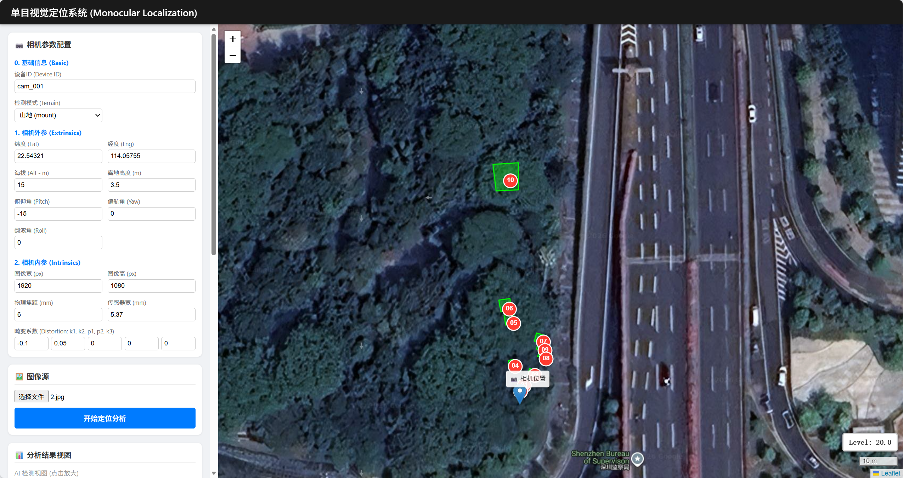
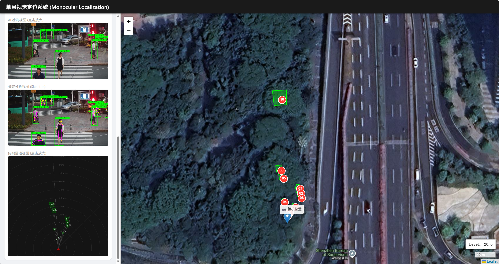

# YOLO-MonoPed-Depth

[中文](README.md) | **[English]**

**YOLO-MonoPed-Depth** is a monocular pedestrian geometric depth estimation system. It innovatively combines **Object Detection (YOLO-Det)** and **Pose Estimation (YOLO-Pose)** to solve the limitations of traditional BBox-based ranging methods, specifically addressing issues like **bending, occlusion, and truncation** by leveraging biomechanical features (e.g., torso length, shoulder width).

The project includes a full **FastAPI Backend**, a **Vue3 Frontend**, and a complete toolchain for evaluation on the **KITTI 3D Dataset**.




## 📖 Table of Contents

* [1. Background and Algorithm Design](README_EN#1-background--algorithm)
* [2. Project Structure](README_EN#2-structure)
* [3. Quick Start](README_EN#3-quick-start)
* [4. KITTI Evaluation Results](README_EN#4-kitti-evaluation)
* [5. Acknowledgements](README_EN#5-acknowledgment)

## 1. Background & Algorithm

### 1.1 Background

Traditional monocular localization methods often rely on Bounding Box height, assuming a fixed standing height (e.g., 1.7m). However, this assumption fails when:

* **Deformation**: Pedestrians bend over or squat, causing BBox height to shrink.
* **Occlusion/Truncation**: Only the upper body is visible.

### 1.2 Smart Skeleton Ranging

We introduce a `PoseConverter` module with a **Cascade Strategy** to find the most reliable "rigid body" part:

1. **Level 1: Torso (Best)**: Euclidean distance between shoulder center and hip center. Robust against bending.
2. **Level 2: Shoulder Width (Half-body Mode)**: Automatically activated when legs are truncated. Includes a "Ratio Check" to handle side-views.
3. **Level 3: Limbs (Fallback)**: Uses upper arm or thigh, strictly validated by a "Verticality Check" to avoid perspective foreshortening errors.

## 2. Structure

*(See the Directory Structure in the Chinese section above)*
```text
root/                           # [Root project directory]
├─ backend/                     # [Backend] Based on FastAPI + Ultralytics
│   ├─ api/                     # API routing and schema definition
│   ├─ data/                    # Data storage area
│   │   └── KITTI.md            # Detailed description of KITTI dataset
│   ├─ models/                  # Model weights storage (Detect/Pose)
│   ├─ src/                     # Core algorithm source code
│   │   ├─ detector.py          # YOLO inference encapsulation (supports Batch Inference acceleration)
│   │   ├─ geolocalizer.py      # Geolocation and coordinate conversion core
│   │   ├─ pose_utils.py        # [Core] Smart Skeleton Length Extraction Strategy
│   │   └── visualizer.py       # Visualization plotting (skeleton graph/radar chart)
│   ├─ infer_loc.py             # Single image/video inference demo script
│   ├── kitti_infer.py          # Batch inference script for KITTI dataset (including Warmup & timing)
│   ├── kitti_eval.py           # KITTI evaluation metric calculation (ALE/ALP)
│   ├─ main.py                  # Backend service entry point
│   └── requirements.txt
│
└── frontend/                   # [Frontend] Vue 3 + Vite
    ├── src/
    │   ├── components/
    │   ├─ App.vue              # Main interactive page (parameter configuration/map display)
    │   └── main.js
    └── vite.config.js

```

## 3. Quick Start

For detailed operating parameters, please refer to: [RUN.md](RUN.md#1.run)

### 3.1 Setup

* **Backend** (default port 8001): Requires a Python environment with CUDA support (recommended). For environment configuration, refer to [Backend](backend/RUN-python.md#1.env).
* **Frontend** (default port 5173): Requires a Node.js environment. For environment configuration, refer to [Frontend](frontend/RUN-vue.md#1.env).

### 3.2 Start

**Terminal 1: Backend**

```shell
cd backend
pip install -r requirements.txt
python main.py

```

**Terminal 2: Frontend**

```shell
cd frontend
npm install
npm run dev

```

Visit `http://localhost:5173` to access the Web UI. Support uploading images, adjusting camera extrinsic parameters (Pitch/Height), switching between **Flat/Mount** modes, and viewing real-time positioning results (satellite map + overhead radar).

## 4. KITTI Evaluation

We benchmarked our method on the **KITTI 3D Object Detection Dataset**. See [backend/data/KITTI.md](backend/data/KITTI.md) for details.

Key Highlights:

* **Accuracy**: Achieved an ALE of **0.99m** on the Easy set.
* **Speed**: Optimized with **Batch Inference** for Pose, achieving **~34ms per image** (Real-time).

Performance on the KITTI training + validation set using `yolo26l.pt` (Detect) + `yolo11l-pose.pt` (Pose): 

```text
================================================================================
Difficulty      | Count    | ALE (m)    | ALP (<0.5m)  | ALP (<1m)  | ALP (<2m)
--------------------------------------------------------------------------------
Easy            | 2049     | 0.993      | 40.7        % | 67.4      % | 87.9      %
Moderate        | 2700     | 1.085      | 38.4        % | 65.2      % | 85.8      %
Hard            | 2888     | 1.138      | 37.5        % | 63.7      % | 84.5      %
All             | 2954     | 1.131      | 37.7        % | 63.9      % | 84.6      %
--------------------------------------------------------------------------------
Time Statistics (Mean on RTX 4090):
  Det : 18.6 ms
  Pose: 15.3 ms (Batch Inference)
  Infr: 34.1 ms (Total per Image)
Average FPS: ~29 FPS
================================================================================

```


## 5. Acknowledgment

* [YOLO](https://github.com/ultralytics/ultralytics)
* [MonoLoco](https://github.com/vita-epfl/monoloco)
* [KITTI 3D](https://www.cvlibs.net/datasets/kitti/eval_object.php?obj_benchmark=3d)
* [Gemini](https://gemini.google.com)
