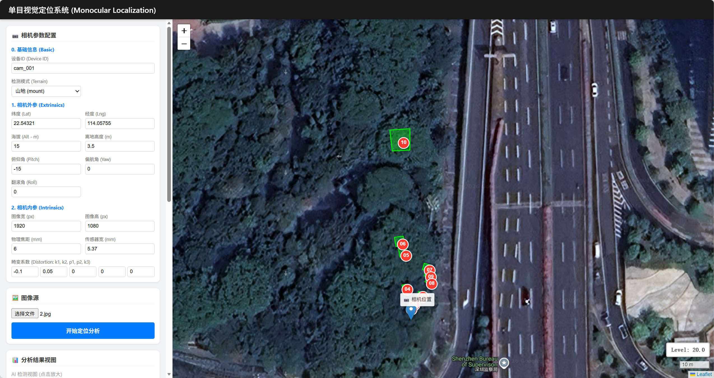
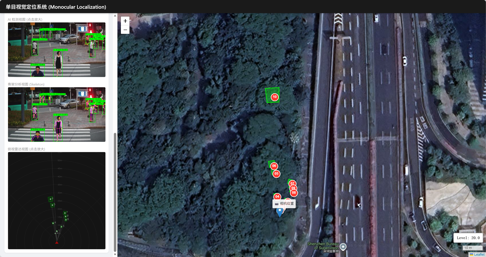
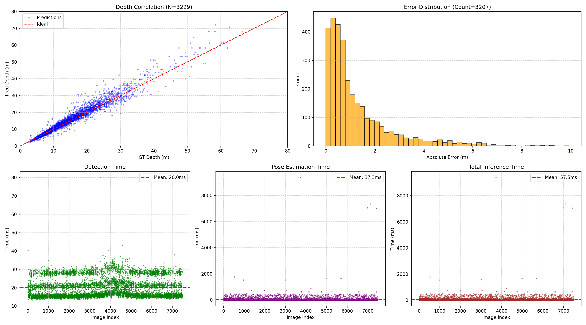

# YOLO-MonoPed-Depth

[中文](README.md) | **[English]**

**YOLO-MonoPed-Depth** is a monocular pedestrian geometric depth estimation system. It combines **Object Detection (YOLO-Det)** and **Pose Estimation (YOLO-Pose)** to solve the limitations of traditional BBox-based ranging methods, specifically addressing issues like **bending, occlusion, and truncation** by leveraging biomechanical features (e.g., torso length, shoulder width).

The project includes a full **FastAPI Backend**, a **Vue3 Frontend**, and a complete toolchain for evaluation on the **KITTI 3D Dataset**.




## 📖 Table of Contents

* [1. Background and Algorithm Design](README_EN#1-background--algorithm)
* [2. Project Structure](README_EN#2-structure)
* [3. Quick Start](README_EN#3-quick-start)
* [4. KITTI Evaluation Results](README_EN#4-kitti-evaluation)
* [5. Acknowledgements](README_EN#5-acknowledgment)

## 1. Background & Algorithm

### 1.1 Background

Traditional monocular localization methods often rely on Bounding Box height, assuming a fixed standing height (e.g., 1.7m). However, this assumption fails when:

* **Deformation**: Pedestrians bend over or squat, causing BBox height to shrink.
* **Occlusion/Truncation**: Only the upper body is visible.

### 1.2 Smart Skeleton Ranging

We introduce a `PoseConverter` module with a **Cascade Strategy** to find the most reliable "rigid body" part:

1. **Level 1: Torso (Best)**: Euclidean distance between shoulder center and hip center. Robust against bending.
2. **Level 2: Shoulder Width (Half-body Mode)**: Automatically activated when legs are truncated. Includes a "Ratio Check" to handle side-views.
3. **Level 3: Limbs (Fallback)**: Uses upper arm or thigh, strictly validated by a "Verticality Check" to avoid perspective foreshortening errors.

## 2. Structure

*(See the Directory Structure in the Chinese section above)*
```text
root/                             # [Root project directory]
├── backend/                      # [Backend] Based on Flask + Ultralytics (Refactored)
│   ├── api/                      
│   │   └── schemas.py            # Pydantic data validation and response models
│   ├── data/                     # Data storage area and evaluation results
│   │   └── KITTI.md              # Detailed description of KITTI dataset evaluation
│   ├── models/                   # Model weights pool
│   │   ├── Detect/               # Detection models (yolo11l.pt, yolo26l.pt, etc.)
│   │   └── Pose/                 # Pose estimation models (yolo11l-pose.pt, etc.)
│   ├── src/                      # Core algorithm engine library
│   │   ├── detector.py           # YOLO inference wrapper (supports Batch Inference & dynamic GPU model caching)
│   │   ├── geolocalizer.py       # Geolocation and coordinate conversion core (Flat/Mount dual modes)
│   │   ├── pose_utils.py         # [Core] Biomechanics-based smart skeleton distance estimation strategy
│   │   ├── utils.py              # Utility classes (Base64 encoding/decoding, polygon geo-coordinate calculation, etc.)
│   │   └── visualizer.py         # Visualization plotting (2D bbox, 17-keypoint skeleton graph, BEV radar map)
│   ├── infer_loc.py              # Single image/video inference demo script (CLI)
│   ├── kitti_infer.py            # KITTI dataset batch inference workflow (includes Warmup & timing)
│   ├── kitti_eval.py             # KITTI evaluation script (AP_R40, ALE/ALP error distribution statistics)
│   ├── main.py                   # [Entry] Flask Web service, providing RESTful APIs
│   └── requirements.txt          # Python dependencies list
│
└── frontend/                     # [Frontend] Vue 3 + Vite
    ├── public/                   # Static assets (e.g., icons, favicon)
    ├── src/
    │   ├── api/                  # Unified API request management
    │   │   └── localization.js   # Encapsulated Axios request logic to decouple business logic
    │   ├── assets/               # Internal static assets
    │   ├── components/           # Modularized Vue components library
    │   │   ├── ConfigForm.vue    # Left sidebar: parameter config form & image upload
    │   │   ├── ResultGallery.vue # Left sidebar: AI detection/skeleton/radar views display
    │   │   ├── MapDisplay.vue    # Right main view: Leaflet map rendering & target markers
    │   │   └── ImageModal.vue    # Floating component: fullscreen image viewer & downloader
    │   ├── App.vue               # [Core] Minimalist main page container (state management & component dispatch)
    │   ├── main.js               # Core entry file (mounts Vue instance & Leaflet styles)
    │   └── style.css             # Global unified UI style library (Dark tech theme)
    ├── index.html                # HTML template
    ├── package.json              # Frontend dependencies (axios, leaflet, vue-leaflet, etc.)
    └── vite.config.js            # Vite build configuration
```

## 3. Quick Start

For detailed operating parameters, please refer to: [RUN.md](RUN.md#1.run)

### 3.1 Setup

* **Backend** (default port 8001): Requires a Python environment with CUDA support (recommended). For environment configuration, refer to [Backend](backend/RUN-python.md#1.env).
* **Frontend** (default port 5173): Requires a Node.js environment. For environment configuration, refer to [Frontend](frontend/RUN-vue.md#1.env).

### 3.2 Start

**Terminal 1: Backend**

```shell
cd backend
pip install -r requirements.txt
python main.py

```

**Terminal 2: Frontend**

```shell
cd frontend
npm install
npm run dev

```

Visit `http://localhost:5173` to access the Web UI. Support uploading images, adjusting camera extrinsic parameters (Pitch/Height), switching between **Flat/Mount** modes, and viewing real-time positioning results (satellite map + overhead radar).

## 4. KITTI Evaluation

We benchmarked our method on the **KITTI 3D Object Detection Dataset**. See [backend/data/KITTI.md](backend/data/KITTI.md) for details.

Key Highlights:

* **Accuracy**: Achieved an ALE of **0.99m** on the Easy set.
* **Speed**: Optimized with **Batch Inference** for Pose, achieving **~34ms per image** (Real-time).

Performance on the KITTI training + validation set using `yolo26x.pt` (Detect) + `yolo26x-pose.pt` (Pose): 

```text
==============================================================================================================
 EVALUATION REPORT (Pedestrian, IoU=0.5)
--------------------------------------------------------------------------------------------------------------
Difficulty   | Count   | AP_R11   | AP_R40   | ALE Mean   | ALE Min  | ALE Max  | ALE Std  | ALP <0.5m | ALP <1m | ALP <2m
--------------------------------------------------------------------------------------------------------------
Easy         | 2151    | 67.66    | 66.61    | 1.137      | 0.000    | 12.487   | 1.290    | 37.1    % | 63.3  % | 83.8  %
Moderate     | 2938    | 57.14    | 57.91    | 1.331      | 0.000    | 13.918   | 1.633    | 34.8    % | 59.5  % | 80.1  %
Hard         | 3142    | 50.38    | 50.56    | 1.381      | 0.000    | 13.918   | 1.692    | 34.2    % | 58.5  % | 79.0  %
All          | 3229    | -        | -        | 1.394      | 0.000    | 31.578   | 1.797    | 34.3    % | 58.7  % | 79.1  %
--------------------------------------------------------------------------------------------------------------
Time Statistics (per image):
  Det   : Mean=20.0ms, Min=13.3ms, Max=79.9ms, Std=5.4ms
  Pose  : Mean=37.3ms, Min=0.0ms, Max=9366.1ms, Std=200.2ms
  Infr  : Mean=57.5ms, Min=13.3ms, Max=9386.3ms, Std=200.5ms
==============================================================================================================
```



## 5. Acknowledgment

* [YOLO](https://github.com/ultralytics/ultralytics)
* [MonoLoco](https://github.com/vita-epfl/monoloco)
* [KITTI 3D](https://www.cvlibs.net/datasets/kitti/eval_object.php?obj_benchmark=3d)
* [Gemini](https://gemini.google.com)
